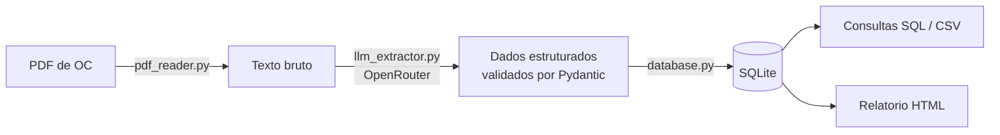

# oc-agent-automation


Pipeline que le Ordens de Compra (OC) recebidas em PDF de hospitais clientes, extrai os dados estruturados usando um LLM via OpenRouter e carrega o resultado em um banco relacional, de onde podem ser feitas consultas SQL, exportacoes em CSV e um relatorio HTML final.

Projeto inspirado no caso real de uma distribuidora de produtos para saude (OPME), que recebe OCs de dezenas de hospitais, cada um com um layout de documento diferente. Em vez de um parser por template, a extracao usa um LLM com schema fixo, o que permite lidar com um layout novo sem escrever codigo novo. Ver [docs/case_study.md](docs/case_study.md) para o raciocinio completo por tras dessa decisao.

## Pipeline



Detalhes de cada componente em [docs/architecture.md](docs/architecture.md). Modelo de dados completo em [docs/data_model.md](docs/data_model.md). Regras de governanca e boas praticas (o que o sistema sinaliza, o que ele nunca faz automaticamente, e por que) em [docs/boas_praticas_e_governanca.md](docs/boas_praticas_e_governanca.md).

## Modo demo vs producao

O repositorio roda por padrao em modo demo, usando quatro PDFs sinteticos incluidos em `demo_data/pdfs/` (dados de hospitais, CNPJs e pacientes 100% ficticios, gerados por `demo_data/generate_demo_pdfs.py`). Isso permite ver o pipeline completo funcionando sem nenhuma credencial de infraestrutura.

A extracao em si sempre chama a API de verdade (via OpenRouter), mesmo em modo demo: nao existe um extrator simulado. Por isso uma `OPENROUTER_API_KEY` valida e necessaria em qualquer modo. O modelo usado (`OPENROUTER_MODEL` no `.env`) e configuravel sem mexer em codigo - ver o comentario no topo de `src/llm_extractor.py` para os modelos ja avaliados neste projeto.

Para ligar o modo producao, configure `MODO_EXECUCAO=producao` e `PASTA_ENTRADA_OC` no `.env` (ou passe `--pasta` na linha de comando) apontando para uma pasta local ou de rede onde os PDFs de OC ja tenham sido salvos, por exemplo por uma regra do Outlook que salva anexos automaticamente. Nao ha integracao direta com uma caixa de e-mail nem credenciais de Azure envolvidas: o pipeline so precisa do caminho da pasta. Cada PDF processado com sucesso e movido para uma subpasta `processados/` dentro da pasta de entrada.

**Demo e producao gravam em bancos e relatorios separados**, para nunca misturar dado sintetico com dado real: modo demo usa `output/database/oc_agent_demo.db` e gera `output/report/relatorio_demo.html`; modo producao usa `output/database/oc_agent.db` e gera `output/report/relatorio.html`. Tanto `pipeline.py` quanto `report_generator.py` aceitam `--modo demo|producao` (e `--db`/`--saida` para sobrepor o caminho manualmente, se precisar).

## Como rodar

```bash
python -m venv .venv
.venv\Scripts\activate          # Windows
# source .venv/bin/activate     # Linux/Mac

pip install -r requirements.txt
copy .env.example .env           # Windows
# cp .env.example .env           # Linux/Mac
# edite o .env e preencha OPENROUTER_API_KEY

python src/pipeline.py --modo demo
python src/report_generator.py --modo demo

# modo producao, lendo PDFs de uma pasta configurada:
python src/pipeline.py --modo producao --pasta "C:\caminho\para\pasta_de_ocs"
python src/report_generator.py --modo producao
```

O painel e gerado em `output/report/relatorio_demo.html` (modo demo) ou `output/report/relatorio.html` (modo producao), lendo de `output/database/oc_agent_demo.db` ou `output/database/oc_agent.db` respectivamente - os dois nunca se misturam. A leitura e pensada de cima para baixo: indicadores executivos (incluindo quantas OCs tem algum alerta), os dois graficos de negocio lado a lado, a tabela de OCs recentes (com uma coluna de status OK/Revisar), uma central de alertas unica (duplicidade, valor divergente, baixa confianca, CNPJ invalido, cada um com seu selo colorido) e, por fim, uma secao de auditoria mais discreta com o log completo de extracoes. Nada na central de alertas e corrigido ou excluido automaticamente - ver [docs/boas_praticas_e_governanca.md](docs/boas_praticas_e_governanca.md).

### Testando com PDFs reais (com dados clinicos redigidos)

Para testar a extracao contra OCs reais sem enviar dado de paciente para a API do modelo, existe um utilitario de redacao. Ele le o texto do PDF real, mascara qualquer campo clinico conhecido (paciente, convenio, carteirinha, cirurgiao, CRM, aviso de cirurgia, data de realizacao, setor) e grava uma copia redigida:

```bash
# coloque os PDFs reais em entrada_real/ (pasta ignorada pelo git)
python scripts/redigir_dados_clinicos.py entrada_real entrada_real_redigida

python src/pipeline.py --modo producao --pasta entrada_real_redigida
```

As pastas `entrada_real/` e `entrada_real_redigida/` nunca sao versionadas (ver `.gitignore`). A redacao e baseada em padroes de texto, nao e uma garantia formal de anonimizacao: revise o PDF gerado antes de confiar nele para qualquer uso alem de teste local.

Para exportar uma consulta em CSV (sem depender do cliente de linha de comando `sqlite3`, que nao vem instalado por padrao no Windows):

```bash
python src/export_csv.py
# ou apontando para outra consulta, por exemplo os itens de cada OC com numero e cliente:
python src/export_csv.py --query sql/queries/itens_por_oc.sql --saida output/csv/itens_por_oc.csv
# por padrao le o banco de producao (oc_agent.db); para exportar do banco de demo:
python src/export_csv.py --db output/database/oc_agent_demo.db --saida output/csv/ordens_compra_demo.csv
```

## Testes

```bash
pytest tests/ -v
```

Os testes de extracao via LLM usam um cliente OpenRouter/OpenAI simulado (nao fazem chamada de API real), enquanto os testes de leitura de PDF e banco de dados rodam contra os quatro PDFs sinteticos incluidos no repositorio. Um workflow do GitHub Actions (`.github/workflows/testes.yml`) roda essa mesma suite automaticamente a cada push, sem custo de API.

## Harness de avaliacao da extracao

Diferente da suite de testes acima, `scripts/avaliar_extracao.py` chama a API de verdade (via OpenRouter, usando o modelo configurado em `OPENROUTER_MODEL`) contra os 4 PDFs sinteticos e compara o resultado, campo a campo, com o gabarito conhecido (os valores exatos usados para gerar esses PDFs). Serve para medir objetivamente a qualidade da extracao, nao so se o codigo funciona, e tambem para comparar modelos diferentes entre si:

```bash
python scripts/avaliar_extracao.py
# depois, para comparar outro modelo, so muda OPENROUTER_MODEL no .env e roda de novo
```

A saida mostra qual modelo foi avaliado, o percentual de acerto por arquivo e no total, alem de listar exatamente quais campos vieram diferentes do esperado. Como faz chamadas reais a API (custa tempo e credito), nao roda junto com o `pytest` automatico - e uma ferramenta para rodar manualmente ao mudar o prompt, o schema, ou o modelo usado.

## Estrutura do repositorio

```
oc-agent-automation/
├── demo_data/
│   ├── generate_demo_pdfs.py   # gera os 4 PDFs sinteticos de demonstracao
│   └── pdfs/                    # os 4 PDFs sinteticos ja gerados
├── docs/
│   ├── architecture.md
│   ├── data_model.md
│   ├── case_study.md
│   └── interview_pitch.md
├── sql/
│   ├── schema.sql
│   └── queries/                 # consultas prontas (valor por cliente, itens por OC, itens recorrentes, etc.)
├── src/
│   ├── schema.py                # modelos Pydantic
│   ├── pdf_reader.py            # extracao de texto (pdfplumber + OCR fallback)
│   ├── llm_extractor.py         # extracao estruturada via OpenRouter (modelo configuravel)
│   ├── database.py              # schema SQLite e persistencia
│   ├── folder_watcher.py        # leitura de PDFs de uma pasta de entrada (modo producao)
│   ├── pipeline.py              # orquestrador (demo vs producao)
│   ├── report_generator.py      # relatorio HTML final
│   └── export_csv.py            # exportacao de consultas SQL para CSV
├── tests/
└── output/
    ├── database/
    ├── csv/
    └── report/
```

## Dados sensiveis (LGPD)

Quando presentes no campo de observacao da OC, dados de paciente, convenio e cirurgiao sao extraidos para uma tabela separada (`dados_clinicos`), fisicamente isolada das tabelas comerciais. Nenhuma consulta SQL de faturamento, exportacao CSV ou o relatorio HTML final tem acesso a essa tabela. Os PDFs sinteticos usados neste repositorio contem apenas nomes e dados inventados.

## Licenca

MIT.
