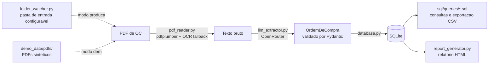

# Arquitetura

## Visao geral

O oc-agent-automation le Ordens de Compra (OC) recebidas em PDF, extrai os dados estruturados usando um modelo de linguagem e carrega o resultado em um banco relacional, de onde podem ser feitas consultas SQL, exportacoes em CSV e um relatorio HTML final.

A decisao central de arquitetura e nao usar um parser posicional por template. Cada hospital cliente emite OCs em um layout visual diferente (ver [data_model.md](data_model.md) para os quatro padroes identificados), e um parser baseado em coordenadas de texto ou expressoes regulares precisaria ser reescrito a cada novo cliente. Em vez disso, o texto bruto extraido do PDF e enviado a um LLM com um schema fixo, e o modelo devolve os campos ja normalizados, independente de como o documento de origem esta desenhado.

## Diagrama do pipeline

## Componentes

`src/schema.py`
Modelos Pydantic (OrdemDeCompra, ItemOC, DadosClinicos, Cliente, Fornecedor) que definem o contrato entre a extracao via LLM e o banco de dados. Qualquer PDF, de qualquer layout, precisa ser normalizado para esta mesma estrutura antes de ser persistido.

`src/pdf_reader.py`
Extrai o texto de cada pagina do PDF via pdfplumber. Quando uma pagina nao tem texto selecionavel (documento escaneado), cai para OCR via pytesseract e pdf2image. Essa dependencia de OCR e opcional e so e importada quando realmente acionada.

`src/llm_extractor.py`
Envia o texto extraido a um LLM via OpenRouter (https://openrouter.ai, uma API unica compativel com o formato da OpenAI que da acesso a modelos de varios provedores - Anthropic, OpenAI, DeepSeek, Z.ai, etc) com um prompt fixo, pedindo retorno em JSON no schema de OrdemDeCompra. O modelo usado e configuravel via `OPENROUTER_MODEL` no `.env`, sem mudar nenhum codigo (ver o comentario no topo do arquivo com os modelos ja avaliados e seus precos aproximados). O JSON retornado e validado com Pydantic antes de seguir para o banco. Se a resposta nao for JSON valido ou nao corresponder ao schema, a falha e registrada e o pipeline continua para o proximo arquivo. Falhas transitorias (erro de rede, limite de taxa, erro temporario do servidor) sao retentadas automaticamente, com espera crescente entre as tentativas; falhas nao transitorias (chave invalida, schema incompativel) falham na hora, sem retry.

`src/database.py`
Cria o schema SQLite (definido em `sql/schema.sql`) e persiste os objetos validados. As operacoes de escrita sao idempotentes por numero da OC e arquivo de origem, entao reprocessar o mesmo PDF nao duplica registros. Quando a mesma OC (mesmo numero + mesmo cliente) aparece em arquivos diferentes, provavel resultado do mesmo PDF sendo salvo duas vezes pela automacao de ingestao, o modulo sinaliza os registros com `status_extracao = 'possivel_duplicata'`, mas nunca os exclui - ver "Tratamento de duplicidades" abaixo. Tambem confere se a soma dos itens bate com o valor total declarado (`alerta_valor_divergente`), se a confianca relatada pelo modelo ficou abaixo do limite (`alerta_baixa_confianca`), e se o CNPJ do cliente/fornecedor passa na validacao de digito verificador (`alerta_cnpj_invalido`, via `src/validadores.py`). `inicializar_schema()` adiciona colunas novas via `ALTER TABLE` a um banco ja existente, sem apagar dados (SQLite nao migra schema automaticamente). `fazer_backup()` copia o banco para `output/database/backups/` antes de cada execucao, mantendo apenas os N backups mais recentes.

`src/validadores.py`
Validacoes deterministicas, independentes do LLM - hoje, so a confirmacao do digito verificador de um CNPJ. Serve de segunda camada de verificacao: um CNPJ com digito errado e um sinal inequivoco de erro, ao contrario dos demais alertas do projeto (duplicidade, divergencia de valor, baixa confianca), que dependem de julgamento.

`src/folder_watcher.py`
Le os PDFs pendentes de uma pasta de entrada configuravel (local ou de rede). Usado apenas no modo producao, sem exigir nenhuma credencial de infraestrutura: a pasta pode ser alimentada por uma regra do Outlook que salva anexos automaticamente, por um scanner, ou por upload manual. Cada PDF processado com sucesso e movido para uma subpasta `processados/`, para que a pasta de entrada sempre reflita apenas o que ainda falta processar. Um arquivo que falha repetidamente e movido para uma subpasta `falhas/` em vez de ser tentado para sempre.

`src/pipeline.py`
Orquestrador que decide a origem dos PDFs (demo_data/pdfs em modo demo, ou a pasta configurada via folder_watcher.py em modo producao) e executa a sequencia pdf_reader -> llm_extractor -> database para cada arquivo, registrando sucesso ou falha em `log_extracao`. Move arquivos com falhas acumuladas (`LIMITE_FALHAS_QUARENTENA`) para a pasta de quarentena, e registra um alerta destacado no log quando muitos arquivos falham em uma unica execucao (`LIMITE_ALERTA_FALHAS`). Faz backup do banco antes de cada execucao, e limita quantos arquivos processa por execucao (`LIMITE_ARQUIVOS_POR_EXECUCAO`, 0 = sem limite) para nao estourar limite de taxa da API se a pasta acumular muitos PDFs. Grava log tanto no console quanto em arquivo rotativo (`output/logs/pipeline.log`), util quando o pipeline roda sem ninguem olhando o terminal (ex: via Agendador de Tarefas do Windows).

`src/report_generator.py`
Le o banco e gera um painel HTML autocontido, sem dependencia de CDN externo, no estilo cards, responsivo (funciona de celular a monitor grande) e com tema claro/escuro automatico. Organizado em abas trocadas via JS (sem reload): "Analytics" (indicadores e graficos de negocio) e "Detalhada" (exportacao CSV, tabela de OCs recentes, central unica de alertas de qualidade de dado, e a secao de auditoria visualmente discreta). Nao existe uma aba/coluna mostrando a imagem do PDF em si - em producao esses documentos tem dado de saude do paciente (LGPD), entao nunca devem ficar embutidos no painel. Em vez disso, toda referencia a um arquivo de origem (na tabela de OCs recentes, na central de alertas, no log de auditoria) vira um link clicavel via `_link_documento()` quando `URL_PASTA_ENTRADA_OC` esta configurada no `.env` - em producao, essa URL aponta para a pasta no OneDrive/SharePoint da empresa, entao abrir o link exige a autenticacao Microsoft de quem estiver acessando; sem a variavel configurada, mostra so o nome do arquivo, sem link. Nao inclui nenhum campo da tabela dados_clinicos.

## Modo demo vs producao

O pipeline roda por padrao em modo demo, usando os quatro PDFs sinteticos incluidos no repositorio. Isso permite clonar o projeto e ver o pipeline funcionando sem nenhuma credencial de infraestrutura. A extracao em si, no entanto, sempre chama a API de verdade via OpenRouter (nao ha um extrator simulado), entao uma OPENROUTER_API_KEY valida e necessaria em qualquer modo.

O modo producao troca apenas a origem dos PDFs: em vez de ler `demo_data/pdfs/`, o pipeline le os PDFs pendentes de uma pasta configurada em `PASTA_ENTRADA_OC` (ou via `--pasta` na CLI). Essa pasta e alimentada por fora do pipeline (uma regra do Outlook que salva anexos automaticamente, uma pasta de rede compartilhada, ou upload manual), o que evita depender de credenciais de Azure AD ou de uma integracao direta com uma API de e-mail. O restante do fluxo (leitura, extracao, banco) e identico.

Os dois modos gravam em bancos SQLite separados (`database.DB_DEMO_PATH` = `oc_agent_demo.db`, `database.DB_PADRAO_PATH` = `oc_agent.db`), escolhidos automaticamente a partir de `--modo` em `pipeline.py`, ou sobrepostos manualmente via `--db`. `report_generator.py` segue a mesma logica com seu proprio `--modo`, gerando `relatorio_demo.html` ou `relatorio.html` a partir do banco correspondente. Essa separacao existe para que dado sintetico (usado para demonstrar o projeto) nunca apareca misturado com dado real de producao no mesmo painel ou na mesma consulta.

## Tratamento de dados sensiveis (LGPD)

Dados clinicos (nome do paciente, convenio, carteirinha, cirurgiao, data de realizacao) aparecem no campo de observacao de algumas OCs. Esses dados sao extraidos para uma tabela propria (`dados_clinicos`), separada fisicamente das tabelas comerciais. Nenhuma consulta SQL de faturamento, exportacao CSV ou o relatorio HTML final faz join com essa tabela. Isso mantem a separacao entre dado comercial (livre para analise e compartilhamento interno) e dado de saude (uso restrito).

## Tratamento de duplicidades

Quando o mesmo PDF acaba sendo salvo mais de uma vez na pasta de entrada (por exemplo, por uma falha de automacao que reprocessa o mesmo e-mail), o pipeline nao tenta adivinhar qual copia excluir. Em vez disso, `database.py` detecta quando ha mais de uma OC com o mesmo `numero_oc` e o mesmo `cliente_id`, mas arquivos de origem diferentes, e marca todos os registros do grupo com `status_extracao = 'possivel_duplicata'`. Nenhuma linha e removida automaticamente.

Esse e um guardrail deliberado do projeto: o pipeline nunca exclui uma ordem de compra por conta propria, para nao correr o risco de apagar um dado valido por engano.

## Central de alertas

Quatro sinalizacoes independentes (duplicidade, valor divergente, baixa confianca, CNPJ invalido) sao unificadas em uma unica consulta (`sql/queries/central_alertas.sql`, uma UNION ALL das quatro), exibida como uma tabela unica no painel HTML, uma linha por (OC, tipo de alerta), cada uma com um selo colorido indicando o tipo. As quatro consultas individuais (`possiveis_duplicatas.sql`, `alertas_valor.sql`, `baixa_confianca.sql`, `cnpj_invalido.sql`) continuam existindo para analise pontual de um tipo especifico, mas o painel mostra a visao consolidada. Todas seguem o mesmo padrao: sinalizar para revisao humana, nunca corrigir ou excluir sozinho.

## Governanca e auditoria

A tabela `log_extracao` registra toda tentativa de extracao, com sucesso ou falha (arquivo, data/hora, status, confianca do modelo, erro quando houver). O painel HTML expoe essa tabela na secao "Auditoria e governanca" (visualmente discreta, no final da pagina), junto com um resumo textual das praticas de governanca do projeto (separacao de dado clinico, politica de nao exclusao automatica). A intencao e que, em caso de auditoria, exista um rastro completo e legivel de o que foi processado, quando, com qual confianca, e o que foi sinalizado para revisao humana.

Importante: a migracao de schema (`_migrar_colunas_ausentes`) so adiciona a coluna nova com o valor padrao - ela nao reprocessa retroativamente os registros ja gravados por uma versao anterior do codigo. Uma OC salva antes de um alerta novo existir nao vai aparecer sinalizada por esse alerta ate ser reprocessada.

Ver [docs/boas_praticas_e_governanca.md](boas_praticas_e_governanca.md) para a lista completa de regras de governanca do projeto (o que e sinalizado, o que nunca e feito automaticamente, e por que), incluindo resiliencia a falhas de rede, quarentena de arquivos problematicos e validacao cruzada de valores.
