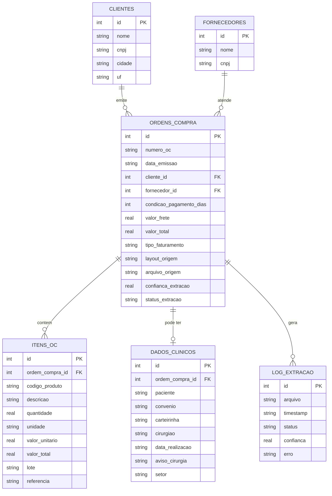

# Modelo de dados

## Os quatro padroes de layout

Os PDFs de Ordem de Compra recebidos pela MDR/Mederi variam de hospital para hospital, mas foram observados quatro padroes visuais recorrentes (a partir de exemplos reais anonimizados). Os PDFs sinteticos em `demo_data/pdfs/` replicam esses quatro padroes com dados ficticios.

| Padrao | Caracteristicas |
|---|---|
| Hospital classico | Cabecalho com dados do hospital, tabela simples de itens, dados clinicos em uma linha de observacao separada por hifens |
| TOTVS tabela larga | Duas colunas (comprador e fornecedor) lado a lado, tabela larga com referencia e lote, rodape identificando o sistema TOTVS |
| MV2000 | Cabecalho de sistema hospitalar "MV 2000", campos linha a linha em vez de tabela, texto corrido denso |
| Grade hospitalar simples | Tabela com bordas visiveis, campos de item multi-linha (lote, referencia e marca em linha propria) |

O objetivo do schema abaixo e representar de forma unica os dados de qualquer um desses quatro padroes, permitindo que o mesmo pipeline de extracao e o mesmo banco sirvam para todos.

## Diagrama entidade-relacionamento

## Por que dados_clinicos e uma tabela separada

Paciente, convenio, carteirinha e cirurgiao sao dados de saude, uma categoria sensivel sob a LGPD. Mante-los em uma tabela isolada, com relacionamento opcional (nem toda OC tem essa informacao) e sem chave estrangeira usada em nenhuma consulta comercial, permite:

- Restringir o acesso a essa tabela separadamente do restante do banco, se necessario.
- Garantir que exportacoes CSV e o relatorio final (pensados para analise de faturamento e volume de compra) nunca incluam, mesmo por engano, um dado de saude de paciente.
- Deletar ou anonimizar esses registros de forma independente, caso um cliente solicite, sem afetar o historico financeiro da OC.

## Por que layout_origem e arquivo_origem ficam em ordens_compra

Esses dois campos existem para rastreabilidade: permitem responder "de qual PDF veio esse registro" e "qual foi o layout detectado" quando uma extracao precisa ser auditada ou reprocessada. `confianca_extracao` e `status_extracao` cumprem o mesmo papel, complementados pela tabela `log_extracao`, que guarda o historico de tentativas (inclusive falhas) por arquivo.

`status_extracao` assume dois valores: `ok` (padrao) ou `possivel_duplicata`, atribuido automaticamente quando a mesma OC (mesmo `numero_oc` e `cliente_id`) aparece em mais de um `arquivo_origem`. Ver [architecture.md](architecture.md#tratamento-de-duplicidades) para o raciocinio completo por tras dessa decisao.

## Como confianca_extracao e calculado

`confianca_extracao` nao e medido pelo codigo Python do pipeline. E o proprio modelo (Claude) que atribui esse numero, seguindo um criterio explicito passado no prompt de extracao (`PROMPT_SISTEMA` em `src/llm_extractor.py`). O criterio tem quatro faixas:

| Faixa | Criterio |
|---|---|
| 0.90 a 1.00 | Todos os campos obrigatorios (numero_oc, cliente, fornecedor, e cada item com descricao/quantidade/valor) foram encontrados de forma explicita e sem ambiguidade no texto, o layout foi claramente reconhecido, e nenhum valor precisou ser inferido ou calculado indiretamente. |
| 0.70 a 0.89 | Os campos obrigatorios foram encontrados, mas algum campo opcional (tipo_faturamento, dados_clinicos) ficou ambiguo ou parcialmente ilegivel, ou o texto tinha pequenos sinais de desalinhamento (colunas de tabela misturadas) que exigiram uma inferencia pequena. |
| 0.50 a 0.69 | Pelo menos um campo obrigatorio foi obtido de forma indireta (por exemplo, quantidade ou valor unitario tiveram que ser calculados a partir de outros numeros porque nao apareciam explicitos), ou o layout nao bateu claramente com nenhum dos padroes conhecidos. |
| Abaixo de 0.50 | Um ou mais campos obrigatorios estao ausentes, ilegiveis, ou o texto extraido do PDF parece corrompido ou incompleto (muitos caracteres estranhos, texto cortado no meio). |

Vale deixar claro o limite disso: como e o proprio LLM que se autoavalia, o numero e uma estimativa do modelo seguindo a regua acima, nao uma medida determinística calculada de forma independente pelo pipeline (o pipeline nao teria como, sozinho, saber se um campo foi "inferido" ou "encontrado explicitamente" no PDF original). Antes dessa regra explicita existir, o prompt so pedia "sua confianca na qualidade da extracao", sem nenhum criterio, o que tornava o numero pouco confiavel para comparar entre extracoes. A regua acima nao elimina a subjetividade do modelo, mas da a ele um criterio concreto e consistente para seguir, em vez de uma impressao livre.

## O campo tipo_faturamento

O campo de observacao de uma OC as vezes traz uma instrucao comercial de faturamento, como "FATURAR E REPOR" (o pedido repõe um estoque consignado) ou apenas "FATURAR" (faturamento simples, sem reposicao). Essa informacao e comercial/logistica, nao clinica, entao fica em `ordens_compra.tipo_faturamento` junto com o restante dos dados financeiros, disponivel para consulta e exportacao normalmente. Nomes de solicitante ou aprovador da OC que aparecem no mesmo campo de observacao nao fazem parte do schema e sao descartados na extracao.
